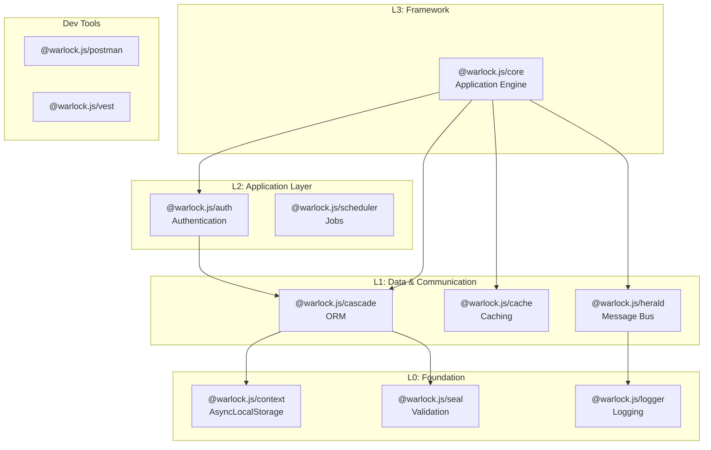

# Warlock.js v4 Documentation Master Plan

> Generated: 2026-01-19 | Based on technical interview and codebase analysis

## Documentation Vision

### Target Audience

**Primary**: Junior developers new to backend development. Make it **super easy** to build small-to-large scale projects without complexity.

**Secondary**: Experienced developers migrating from Express/NestJS/Fastify seeking rich features and productivity gains.

### Architectural Philosophy

- **Explicit over convention** (but convention as sensible default with clear configuration override notes)
- **Progressive disclosure** — Start simple, go deeper step-by-step
- **Feature richness** — Document EVERYTHING to "blow devs' minds" about capabilities
- **Real-world practicality** — Every feature has a use case; show when to use what

### Tone & Structure

**Tone**: Friendly teammate. Focus on "Why" before "How". Practical examples over theory.

**Structure**: Layered learning—quick starts for immediate productivity, comprehensive references for mastery.

---

## Existing Specs Integration

> [!IMPORTANT]
> This plan builds upon extensive prior work in [`specs/`](file:///d:/xampp/htdocs/mongez/node/warlock.js/docs/warlock-docs-latest/specs). **Do not duplicate effort.**

### Prior Work Summary

| Document                                                                                                                                 | Status | Description                                     |
| ---------------------------------------------------------------------------------------------------------------------------------------- | ------ | ----------------------------------------------- |
| [README.md](file:///d:/xampp/htdocs/mongez/node/warlock.js/docs/warlock-docs-latest/specs/README.md)                                     | ✅     | Project tracker - 24 user stories, 37% complete |
| [sidebar-structure-plan.md](file:///d:/xampp/htdocs/mongez/node/warlock.js/docs/warlock-docs-latest/specs/sidebar-structure-plan.md)     | ✅     | Approved sidebar structure (60+ pages)          |
| [core-features-v4.md](file:///d:/xampp/htdocs/mongez/node/warlock.js/docs/warlock-docs-latest/specs/core-features-v4.md)                 | ✅     | Deep-dive of 23 Core modules (854 lines)        |
| [feature-allocation-plan.md](file:///d:/xampp/htdocs/mongez/node/warlock.js/docs/warlock-docs-latest/specs/feature-allocation-plan.md)   | ✅     | Priority-ordered feature allocation             |
| [dev-server-complete-flow.md](file:///d:/xampp/htdocs/mongez/node/warlock.js/docs/warlock-docs-latest/specs/dev-server-complete-flow.md) | ✅     | HMR architecture reference                      |
| US-001 to US-024                                                                                                                         | Mixed  | User story specs (2 done, 22 pending)           |

### Alignment with Existing Structure

The **sidebar-structure-plan.md** defines a 13-section structure. This master plan:

- **Adopts** that sidebar structure as-is
- **Adds** cross-package linking strategy (not covered in specs)
- **Adds** multi-tenancy section (identified in interview)
- **Adds** API inventory artifact for automation

### User Story Progress (from specs/README.md)

```
Getting Started:  US-001 ✅, US-002 ✅, US-003-009 ⏸️
Dev Server:       US-010 ⏸️ (8 pages)
HTTP:             US-011 ⏸️ (9 pages)
Core Sections:    US-012 to US-021 ⏸️
Standalone:       US-022 (Herald), US-023 (Cascade PG), US-024 (Seal) ⏸️
```

**Next priority per specs**: Resume with US-003 (Installation) through US-009, then US-010 (Dev Server).

---

## Package Hierarchy & Classification



### Classification Summary

| Category       | Packages                                | Doc Priority                             |
| -------------- | --------------------------------------- | ---------------------------------------- |
| **Core**       | @warlock.js/core                        | Highest - Foundation of all docs         |
| **Extensions** | auth, cascade, herald                   | High - Feature documentation             |
| **Utilities**  | seal, cache, logger, context, scheduler | Medium - Standalone + Integration guides |
| **Dev Tools**  | postman, vest                           | Lower - Reference documentation          |

---

## Final Approved Site Structure

> **Status**: Approved | ~80 pages total

```
/docs
├── /warlock (Core Framework)
│   ├── /getting-started           [6 pages] CRITICAL
│   │   ├── introduction.mdx
│   │   ├── why-warlock.mdx
│   │   ├── installation.mdx
│   │   ├── concepts.mdx
│   │   ├── project-structure.mdx
│   │   └── env-config.mdx
│   │
│   ├── /http                      [12 pages] CRITICAL
│   │   ├── routing-basics.mdx
│   │   ├── route-builder.mdx
│   │   ├── route-groups.mdx
│   │   ├── api-versioning.mdx
│   │   ├── request.mdx             # Includes: request.input() handles all form types
│   │   ├── response.mdx
│   │   ├── middleware.mdx
│   │   ├── cors.mdx
│   │   ├── rate-limiting.mdx
│   │   ├── file-uploads.mdx
│   │   ├── error-handling.mdx
│   │   └── /restful                # NESTED
│   │       ├── overview.mdx
│   │       ├── controllers.mdx
│   │       ├── lifecycle-hooks.mdx
│   │       └── validation.mdx
│   │
│   ├── /validation                [5 pages] HIGH
│   │   ├── introduction.mdx        # Seal integration
│   │   ├── schema-validation.mdx   # In-depth usage
│   │   ├── framework-plugins.mdx   # v.file(), unique(), exists()
│   │   ├── custom-rules.mdx
│   │   └── error-messages.mdx
│   │
│   ├── /repositories              [6 pages] HIGH
│   │   ├── introduction.mdx        # Data layer: cache + models
│   │   ├── crud-operations.mdx
│   │   ├── filtering.mdx           # filterBy, scopes
│   │   ├── pagination.mdx          # Page, cursor-based
│   │   ├── caching.mdx
│   │   └── custom-repositories.mdx
│   │
│   ├── /database                  [5 pages] HIGH
│   │   ├── introduction.mdx
│   │   ├── configuration.mdx
│   │   ├── migrations.mdx          # Framework collects, Cascade executes
│   │   ├── seeds.mdx               # Framework operation
│   │   └── examples.mdx
│   │
│   ├── /authentication            [6 pages] HIGH
│   │   ├── introduction.mdx
│   │   ├── configuration.mdx
│   │   ├── jwt.mdx
│   │   ├── middleware.mdx
│   │   ├── guards.mdx
│   │   └── access-control.mdx
│   │
│   ├── /storage                   [6 pages] MEDIUM-HIGH
│   │   ├── introduction.mdx
│   │   ├── configuration.mdx
│   │   ├── drivers.mdx             # Local, S3
│   │   ├── file-operations.mdx
│   │   ├── urls.mdx                # Public, signed
│   │   └── scoped-storage.mdx
│   │
│   ├── /cache                     [4 pages] MEDIUM
│   │   ├── introduction.mdx
│   │   ├── configuration.mdx       # Connector
│   │   ├── usage.mdx
│   │   └── drivers.mdx
│   │
│   ├── /dev-server                [6 pages] MEDIUM
│   │   ├── overview.mdx
│   │   ├── hmr.mdx
│   │   ├── health-checks.mdx       # TypeScript, ESLint
│   │   ├── typings-generator.mdx   # Config auto-complete
│   │   ├── configuration.mdx
│   │   └── troubleshooting.mdx
│   │
│   ├── /mail                      [4 pages] MEDIUM-LOW
│   │   ├── introduction.mdx
│   │   ├── configuration.mdx
│   │   ├── sending.mdx
│   │   └── react-templates.mdx
│   │
│   ├── /cli                       [4 pages] MEDIUM-LOW
│   │   ├── commands-overview.mdx
│   │   ├── generating-modules.mdx
│   │   ├── custom-commands.mdx
│   │   └── migrations-cli.mdx
│   │
│   ├── /production                [3 pages] MEDIUM-LOW
│   │   ├── building.mdx
│   │   ├── deployment.mdx
│   │   └── optimization.mdx
│   │
│   ├── /advanced                  [10 pages] LOW
│   │   ├── connectors.mdx
│   │   ├── herald.mdx              # Message bus
│   │   ├── queues.mdx              # Bull (future)
│   │   ├── context.mdx
│   │   ├── multi-tenancy.mdx
│   │   ├── image-processing.mdx
│   │   ├── localization.mdx
│   │   ├── logging.mdx
│   │   ├── warlock-config.mdx
│   │   └── utilities.mdx
│   │
│   └── /upcoming-features          [2 pages] LOW
│       ├── roadmap.mdx
│       └── features.mdx            # MySQL, WebSockets, Queues, etc.
│
├── /cascade (ORM)
│   ├── /getting-started
│   ├── /unified-syntax              # Unified MongoDB + PostgreSQL
│   │   ├── querying.mdx
│   │   ├── mutations.mdx
│   │   └── transactions.mdx
│   ├── /models
│   │   ├── defining-models.mdx
│   │   ├── register-model.mdx      # @RegisterModel decorator
│   │   └── model-events.mdx
│   ├── /data-sources
│   │   ├── mongodb.mdx             # Driver-specific features
│   │   └── postgresql.mdx          # Driver-specific features
│   ├── /relations                  # Joins/lookups
│   │   ├── overview.mdx
│   │   └── relation-types.mdx
│   ├── /sync                       # Embedded documents (json-like)
│   │   ├── overview.mdx
│   │   ├── mongodb-sync.mdx        # Embedded denormalization
│   │   └── sync-patterns.mdx
│   └── /migrations
│
├── /auth
│   ├── introduction.mdx
│   ├── jwt-authentication.mdx
│   ├── access-tokens.mdx
│   ├── refresh-tokens.mdx
│   ├── middleware.mdx
│   └── commands.mdx
│
├── /herald (Message Bus)
│   ├── introduction.mdx
│   ├── rabbitmq.mdx
│   ├── channels.mdx
│   ├── consumable-decorator.mdx    # @Consumable
│   └── patterns.mdx
│
├── /seal (Validation - Standalone)
│   └── [EXISTING STRUCTURE - comprehensive]
│
├── /cache (Standalone)
│   └── [EXISTING STRUCTURE - comprehensive]
│
└── /utilities
    ├── logger.mdx
    ├── context.mdx                 # AsyncLocalStorage
    ├── scheduler.mdx
    └── postman.mdx
```

---

## Standalone Package Documentation Strategy

> [!IMPORTANT]
> Standalone packages (Seal, Cache, Herald, Cascade) require **dual documentation**:

### 1. Standalone Sidebar (Top-Level)

- **Purpose**: Document package as framework-agnostic tool
- **Location**: `/docs/{package}/` with own sidebar entry
- **Target**: Developers using the package outside Warlock
- **Header Link**: Yes (e.g., "Seal", "Cache", "Herald" in main nav)

**Example**: `/docs/seal/` - Comprehensive standalone validation library docs

### 2. Integration Pages (Within `/warlock`)

- **Purpose**: Document how Core extends/integrates the package
- **Location**: `/docs/warlock/{feature}/`
- **Target**: Warlock developers learning framework-specific enhancements
- **Content Focus**:
  - Core's extensions (e.g., `v.file()`, `unique()`, `exists()` for Seal)
  - Integration patterns (e.g., HTTP validation workflow)
  - Warlock-specific configurations

**Example**: `/docs/warlock/http/validation.mdx` - How Core extends Seal for HTTP requests

### Package-Specific Strategy

| Package     | Standalone Docs                               | Integration Docs                                                |
| ----------- | --------------------------------------------- | --------------------------------------------------------------- |
| **Seal**    | Full validator API (handled by another agent) | `warlock/http/validation.mdx` - v.file(), unique/exists plugins |
| **Cascade** | ORM features, drivers, relations, sync        | `warlock/database/` - Core's Cascade integration                |
| **Herald**  | Message bus, RabbitMQ, channels, @Consumable  | `warlock/advanced/herald.mdx` - Herald + Warlock                |
| **Cache**   | Drivers, operations, tags                     | `warlock/cache/` - Existing cache section                       |

---

## Routing Documentation Approach

> **Philosophy**: Document EVERYTHING. Rich features are a selling point.

### Progressive Complexity

```
Basics (Junior-Friendly)     →     Intermediate     →     Advanced
────────────────────────────────────────────────────────────────────
router.get()                  RouteBuilder         Nested routes
router.post()                 .list(), .create()   CRUD builder
Simple handlers               Route groups         Prefixes
                              Middleware per route API versioning
```

### Routing Pages Breakdown

1. **routing-basics.mdx** (Start here)
   - `router.get()`, `post()`, `put()`, `delete()`
   - Simple handler functions
   - Path parameters

2. **route-builder.mdx**
   - Fluent API: `router.route('/posts').get(handler)`
   - RESTful semantic aliases: `.list()`, `.create()`, `.show()`, `.update()`, `.destroy()`
   - Resource methods: `.getOne()`, `.postOne()`

3. **route-groups.mdx**
   - `router.group()` with shared middleware, prefixes
   - `router.prefix()` helper

4. **api-versioning.mdx**
   - Route prefix pattern: `/v1/users`, `/v2/users`
   - Grouping strategies
   - (Open to discussion for header-based versioning)

### RESTful Controllers

**Value Proposition**: Save tons of time on repetitive CRUD operations.

**What developers handle**: Validation + Repository instance

**What Restful class handles**: CRUD methods, lifecycle hooks, middleware execution

**Documentation**: Emphasize override capability but default time-savings.

---

## Cross-Linking Strategy

### Link Types

1. **Upward Links** (Extension → Core)
   - Every extension doc links to Core concepts it uses
   - Example: Auth middleware → Core middleware docs

2. **Downward Links** (Core → Extensions)
   - Core mentions extensions as optional enhancements
   - Example: Core validation → Seal for standalone use

3. **Peer Links** (Same Level)
   - Related features across packages
   - Example: Cascade sync → Herald for event-driven updates

### Required Cross-Links Table

| From               | To                | Context                                                                       |
| ------------------ | ----------------- | ----------------------------------------------------------------------------- |
| Core Validation    | Seal              | "Seal is standalone; Core extends it with FileValidator, unique/exists rules" |
| Core Multi-tenancy | Context           | "Multi-tenancy powered by @warlock.js/context"                                |
| Auth Middleware    | Core Middleware   | "Auth middleware extends Core's middleware system"                            |
| Cascade Models     | Core Repositories | "Models integrate with Repository pattern"                                    |
| Herald             | Core (no events)  | "Core doesn't handle events; use Herald for messaging"                        |
| Cascade Sync       | MongoDB Embedded  | "Sync system for MongoDB embedded data only"                                  |

### Callout Patterns

```mdx
:::info Standalone Package
@warlock.js/seal works independently of Warlock. Use it in any Node.js project.
:::

:::tip Warlock Extension
When used with @warlock.js/core, validation integrates with the HTTP layer automatically.
:::
```

---

## Documentation Gaps to Address

### High Priority

| Gap                        | Package         | Action | Notes                                        |
| -------------------------- | --------------- | ------ | -------------------------------------------- |
| Multi-tenancy guide        | Core + Context  | NEW    | Middleware pattern, Context Manager          |
| Routing comprehensive docs | Core Router     | EXPAND | Split into 4+ pages (basics → advanced)      |
| HMR Guide                  | Core Dev Server | NEW    | `yarn dev` vs `yarn dev -f`, troubleshooting |
| PostgreSQL                 | Cascade         | UPDATE | Production-ready status, unified syntax      |
| Sync System                | Cascade         | NEW    | Embedded denormalization for json-like DBs   |
| Seal + Core integration    | Core Validation | NEW    | v.file(), unique/exists plugins              |

### Medium Priority

| Gap                 | Package       | Action  | Notes                                   |
| ------------------- | ------------- | ------- | --------------------------------------- |
| Herald integration  | Herald + Core | NEW     | RabbitMQ setup, @Consumable             |
| RESTful controllers | Core RESTful  | ENHANCE | Lifecycle hooks, time-saving value prop |
| Image processing    | Core Image    | NEW     | Sharp wrapper, upload transformations   |
| React email         | Core Mail     | NEW     | JSX components instead of HTML          |
| Scheduler           | Scheduler     | NEW     | Basic documentation                     |

### TBD (Future)

| Item                                     | Status               | Timeline                              |
| ---------------------------------------- | -------------------- | ------------------------------------- |
| Changelog/Release Notes                  | Not now              | ~2 months (frequent releases planned) |
| API Reference (auto-generated)           | TBD                  | Future                                |
| Code Playground (CodeSandbox/StackBlitz) | TBD                  | Future                                |
| Postman Generator Docs                   | Not implemented yet  | When feature is ready                 |
| Vest (Testing)                           | Not production-ready | When Vest is complete                 |

---

## Content Guidelines

### Code Examples

```typescript
// ✅ DO: Explicit, decorator-minimal approach
const userSchema = v.object({
  name: v.string().required(),
  email: v.string().email().unique("users", "email"),
});

// ✅ DO: Show practical patterns
@RegisterModel("User")
class User extends Model {
  static collectionName = "users";
}

// ❌ DON'T: Heavy decorator usage
// Framework prefers explicit configuration over decorator magic
```

### Tone Examples

```mdx
<!-- ✅ Good: Explains "why" -->

## Why Sync?

MongoDB's embedded documents are fast to read but challenging to update.
When an author's name changes, every post embedding that author needs updating.
The Sync system automates this.

<!-- ❌ Bad: Just "how" -->

## Sync

Call `modelSync(Post).sync()` to update embedded documents.
```

---

## Implementation Phases

### Phase 1: Foundation (Getting Started)

- [ ] Update introduction.mdx
- [ ] Update concepts.mdx with v4 architecture
- [ ] Create project-structure.mdx
- [ ] Document multi-tenancy basics

### Phase 2: Core HTTP

- [ ] Routing with versioning
- [ ] Validation (Core + Seal integration)
- [ ] Dev server & HMR

### Phase 3: Data Layer

- [ ] Cascade MongoDB + PostgreSQL parity
- [ ] Sync system documentation
- [ ] Auth integration

### Phase 4: Advanced & Utilities

- [ ] Herald message bus
- [ ] Scheduler, Logger, Context standalone docs

---

## Artifact References

- **API Inventory**: [`v4-api-inventory.json`](file:///d:/xampp/htdocs/mongez/node/warlock.js/v4-api-inventory.json)
- **Dev Server Spec**: [`specs/dev-server-complete-flow.md`](file:///d:/xampp/htdocs/mongez/node/warlock.js/docs/warlock-docs-latest/specs/dev-server-complete-flow.md)
- **Existing Specs**: `docs/warlock-docs-latest/specs/`

---

## Next Steps

1. ✅ Technical interview completed
2. ✅ API inventory generated
3. ✅ Master plan created
4. ⏳ **User Review** - Approve hierarchy and cross-linking strategy
5. ⬜ Begin Phase 1: Getting Started docs
