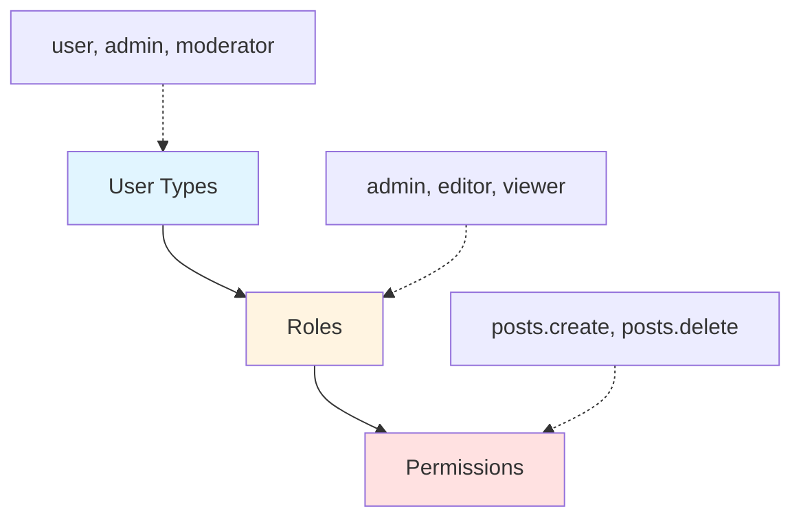

# Access Control

Implement Role-Based Access Control (RBAC) and permission systems in your Warlock.js application. While the auth package provides user type differentiation, this guide shows how to build comprehensive access control on top of it.

> [!NOTE]
> RBAC and permissions are **not built into** the auth package. This page provides implementation patterns and best practices for building your own access control system.

## Understanding the Hierarchy



### User Types (Built-in)

Defined in `src/config/auth.ts`, user types differentiate between different user models:

```typescript
userType: {
  user: User,        // Regular users
  admin: Admin,      // Admin users
  moderator: Moderator,
}
```

Use for: Fundamental user categorization, different data models.

### Roles (Implement Yourself)

Stored in your database, roles group users by their function:

```typescript
// Examples
("admin", "editor", "viewer", "subscriber");
```

Use for: Job functions, access levels within a user type.

### Permissions (Implement Yourself)

Fine-grained actions users can perform:

```typescript
// Examples
("posts.create", "posts.edit", "posts.delete", "users.manage");
```

Use for: Specific action authorization.

## Implementation Approaches

### Approach 1: Simple Role Field

Store a single role on the user model:

```typescript
// app/users/models/user.ts
import { Auth } from "@warlock.js/auth";
import { v } from "@warlock.js/seal";

const userSchema = v.object({
  name: v.string().required(),
  email: v.string().email().required(),
  password: v.string().required(),
  role: v.string().default("user"), // Simple role field
});

export class User extends Auth {
  public static table = "users";
  public static schema = userSchema;

  public get userType(): string {
    return "user";
  }

  public hasRole(role: string): boolean {
    return this.get("role") === role;
  }

  public isAdmin(): boolean {
    return this.hasRole("admin");
  }
}
```

**Usage:**

```typescript
export const deletePostController: RequestHandler = async (
  request,
  response,
) => {
  const user = request.user;

  if (!user.isAdmin()) {
    return response.forbidden({
      error: "Admin access required",
    });
  }

  // Delete post
};
```

### Approach 2: Multiple Roles

Store an array of roles:

```typescript
const userSchema = v.object({
  name: v.string().required(),
  email: v.string().email().required(),
  password: v.string().required(),
  roles: v.array(v.string()).default(["user"]), // Multiple roles
});

export class User extends Auth {
  public hasRole(role: string): boolean {
    const roles = this.get("roles") || [];
    return roles.includes(role);
  }

  public hasAnyRole(roles: string[]): boolean {
    const userRoles = this.get("roles") || [];
    return roles.some((role) => userRoles.includes(role));
  }

  public hasAllRoles(roles: string[]): boolean {
    const userRoles = this.get("roles") || [];
    return roles.every((role) => userRoles.includes(role));
  }
}
```

**Usage:**

```typescript
if (user.hasAnyRole(["admin", "moderator"])) {
  // Allow access
}
```

### Approach 3: Permissions Array

Store permissions directly on the user:

```typescript
const userSchema = v.object({
  name: v.string().required(),
  email: v.string().email().required(),
  password: v.string().required(),
  permissions: v.array(v.string()).default([]), // Direct permissions
});

export class User extends Auth {
  public can(permission: string): boolean {
    const permissions = this.get("permissions") || [];
    return permissions.includes(permission);
  }

  public canAny(permissions: string[]): boolean {
    const userPermissions = this.get("permissions") || [];
    return permissions.some((p) => userPermissions.includes(p));
  }

  public canAll(permissions: string[]): boolean {
    const userPermissions = this.get("permissions") || [];
    return permissions.every((p) => userPermissions.includes(p));
  }
}
```

**Usage:**

```typescript
if (user.can("posts.delete")) {
  // Allow deletion
}
```

### Approach 4: Role-Permission Mapping

Separate roles and permissions with a mapping:

```typescript
// src/config/permissions.ts
export const rolePermissions: Record<string, string[]> = {
  admin: [
    "posts.create",
    "posts.edit",
    "posts.delete",
    "users.manage",
    "settings.manage",
  ],
  editor: ["posts.create", "posts.edit", "posts.delete"],
  viewer: ["posts.view"],
  user: ["posts.view", "posts.create"],
};
```

**User Model:**

```typescript
import { rolePermissions } from "config/permissions";

const userSchema = v.object({
  name: v.string().required(),
  email: v.string().email().required(),
  password: v.string().required(),
  role: v.string().default("user"),
});

export class User extends Auth {
  public getPermissions(): string[] {
    const role = this.get("role");
    return rolePermissions[role] || [];
  }

  public can(permission: string): boolean {
    return this.getPermissions().includes(permission);
  }

  public hasRole(role: string): boolean {
    return this.get("role") === role;
  }
}
```

### Approach 5: Database-Driven RBAC

Full RBAC with database tables:

```
users
├── id
├── name
├── email
└── password

roles
├── id
├── name
└── description

permissions
├── id
├── name
└── description

user_roles
├── userId
└── roleId

role_permissions
├── roleId
└── permissionId
```

**User Model:**

```typescript
export class User extends Auth {
  public async getRoles(): Promise<Role[]> {
    // Load roles from database
    return await Role.query()
      .join("user_roles", "roles.id", "user_roles.roleId")
      .where("user_roles.userId", this.get("id"))
      .get();
  }

  public async getPermissions(): Promise<string[]> {
    const roles = await this.getRoles();
    const permissions = [];

    for (const role of roles) {
      const rolePerms = await role.getPermissions();
      permissions.push(...rolePerms);
    }

    return [...new Set(permissions)]; // Unique permissions
  }

  public async can(permission: string): Promise<boolean> {
    const permissions = await this.getPermissions();
    return permissions.includes(permission);
  }
}
```

## Middleware Implementation

### Role Middleware

```typescript
// src/app/middleware/require-role.ts
import type { Middleware } from "@warlock.js/core";

export function requireRole(roles: string | string[]): Middleware {
  const allowedRoles = Array.isArray(roles) ? roles : [roles];

  return async (request, response) => {
    const user = request.user;

    if (!user) {
      return response.unauthorized({
        error: "Authentication required",
      });
    }

    const userRole = user.get("role");

    if (!allowedRoles.includes(userRole)) {
      return response.forbidden({
        error: "Insufficient permissions",
        requiredRoles: allowedRoles,
        userRole,
      });
    }
  };
}
```

**Usage:**

```typescript
import { authMiddleware } from "@warlock.js/auth";
import { requireRole } from "./middleware/require-role";

router
  .delete("/users/:id", deleteUserController)
  .middleware([authMiddleware(), requireRole("admin")]);
```

### Permission Middleware

```typescript
// src/app/middleware/require-permission.ts
import type { Middleware } from "@warlock.js/core";

export function requirePermission(permission: string): Middleware {
  return async (request, response) => {
    const user = request.user;

    if (!user) {
      return response.unauthorized({
        error: "Authentication required",
      });
    }

    // Assuming user.can() method exists
    if (!user.can(permission)) {
      return response.forbidden({
        error: `Permission '${permission}' required`,
      });
    }
  };
}
```

**Usage:**

```typescript
router
  .delete("/posts/:id", deletePostController)
  .middleware([authMiddleware(), requirePermission("posts.delete")]);
```

### Combined Middleware

```typescript
// src/app/middleware/require-access.ts
import type { Middleware } from "@warlock.js/core";

export function requireAccess(options: {
  roles?: string[];
  permissions?: string[];
  requireAll?: boolean; // Default: false (any)
}): Middleware {
  return async (request, response) => {
    const user = request.user;

    if (!user) {
      return response.unauthorized({
        error: "Authentication required",
      });
    }

    const { roles, permissions, requireAll = false } = options;

    // Check roles
    if (roles && roles.length > 0) {
      const userRole = user.get("role");
      const hasRole = roles.includes(userRole);

      if (!hasRole && requireAll) {
        return response.forbidden({
          error: "Insufficient role",
        });
      }

      if (hasRole && !requireAll) {
        return; // Has role, allow access
      }
    }

    // Check permissions
    if (permissions && permissions.length > 0) {
      const checkMethod = requireAll ? "canAll" : "canAny";
      const hasPermission = await user[checkMethod](permissions);

      if (!hasPermission) {
        return response.forbidden({
          error: "Insufficient permissions",
        });
      }
    }
  };
}
```

**Usage:**

```typescript
// Require admin role OR posts.delete permission
router.delete("/posts/:id", deletePostController).middleware([
  authMiddleware(),
  requireAccess({
    roles: ["admin"],
    permissions: ["posts.delete"],
    requireAll: false, // Any of the above
  }),
]);

// Require editor role AND posts.publish permission
router.post("/posts/:id/publish", publishPostController).middleware([
  authMiddleware(),
  requireAccess({
    roles: ["editor"],
    permissions: ["posts.publish"],
    requireAll: true, // Both required
  }),
]);
```

## Controller-Level Checks

### Simple Checks

```typescript
export const deletePostController: RequestHandler = async (
  request,
  response,
) => {
  const user = request.user;
  const postId = request.params.id;

  // Check permission
  if (!user.can("posts.delete")) {
    return response.forbidden({
      error: "You don't have permission to delete posts",
    });
  }

  // Delete post
  await Post.delete(postId);

  return response.success({
    message: "Post deleted",
  });
};
```

### Ownership Checks

```typescript
export const updatePostController: RequestHandler = async (
  request,
  response,
) => {
  const user = request.user;
  const postId = request.params.id;

  const post = await Post.find(postId);

  if (!post) {
    return response.notFound({
      error: "Post not found",
    });
  }

  // Check ownership or admin role
  const isOwner = post.get("userId") === user.get("id");
  const isAdmin = user.hasRole("admin");

  if (!isOwner && !isAdmin) {
    return response.forbidden({
      error: "You can only edit your own posts",
    });
  }

  // Update post
  await post.merge(request.only(["title", "content"])).save();

  return response.success({ post });
};
```

### Resource-Specific Permissions

```typescript
export const publishPostController: RequestHandler = async (
  request,
  response,
) => {
  const user = request.user;
  const postId = request.params.id;

  const post = await Post.find(postId);

  if (!post) {
    return response.notFound({
      error: "Post not found",
    });
  }

  // Different permissions based on post status
  const requiredPermission =
    post.get("status") === "draft" ? "posts.publish" : "posts.republish";

  if (!user.can(requiredPermission)) {
    return response.forbidden({
      error: `Permission '${requiredPermission}' required`,
    });
  }

  // Publish post
  await post.merge({ status: "published" }).save();

  return response.success({ post });
};
```

## Best Practices

### 1. Centralize Permission Definitions

```typescript
// src/config/permissions.ts
export const Permissions = {
  // Posts
  POSTS_VIEW: "posts.view",
  POSTS_CREATE: "posts.create",
  POSTS_EDIT: "posts.edit",
  POSTS_DELETE: "posts.delete",
  POSTS_PUBLISH: "posts.publish",

  // Users
  USERS_VIEW: "users.view",
  USERS_MANAGE: "users.manage",

  // Settings
  SETTINGS_VIEW: "settings.view",
  SETTINGS_MANAGE: "settings.manage",
} as const;

// Usage
if (user.can(Permissions.POSTS_DELETE)) {
  // ...
}
```

### 2. Cache Permissions

For database-driven RBAC, cache permissions to avoid repeated queries:

```typescript
export class User extends Auth {
  private permissionsCache: string[] | null = null;

  public async getPermissions(): Promise<string[]> {
    if (this.permissionsCache) {
      return this.permissionsCache;
    }

    // Load from database
    const permissions = await this.loadPermissionsFromDatabase();
    this.permissionsCache = permissions;

    return permissions;
  }

  public clearPermissionsCache(): void {
    this.permissionsCache = null;
  }
}
```

### 3. Use Wildcards

Support wildcard permissions for flexibility:

```typescript
export class User extends Auth {
  public can(permission: string): boolean {
    const permissions = this.get("permissions") || [];

    // Exact match
    if (permissions.includes(permission)) {
      return true;
    }

    // Wildcard match (e.g., "posts.*" matches "posts.delete")
    const parts = permission.split(".");
    for (let i = parts.length; i > 0; i--) {
      const wildcard = parts.slice(0, i).join(".") + ".*";
      if (permissions.includes(wildcard)) {
        return true;
      }
    }

    // Super admin (has "*")
    return permissions.includes("*");
  }
}
```

### 4. Audit Access

Log access control decisions:

```typescript
import { log } from "@warlock.js/logger";

export function requirePermission(permission: string): Middleware {
  return async (request, response) => {
    const user = request.user;

    if (!user) {
      return response.unauthorized({
        error: "Authentication required",
      });
    }

    const hasPermission = user.can(permission);

    // Log access attempt
    log.info("access-control", "permission-check", {
      userId: user.get("id"),
      permission,
      granted: hasPermission,
      path: request.path,
    });

    if (!hasPermission) {
      return response.forbidden({
        error: `Permission '${permission}' required`,
      });
    }
  };
}
```

### 5. Test Access Control

```typescript
import { test } from "@warlock.js/testing";

test("admin can delete any post", async () => {
  const admin = await createUser({ role: "admin" });
  const post = await createPost({ userId: 999 }); // Different user

  const response = await request
    .delete(`/posts/${post.id}`)
    .authenticate(admin);

  expect(response.status).toBe(200);
});

test("user cannot delete others' posts", async () => {
  const user = await createUser({ role: "user" });
  const post = await createPost({ userId: 999 }); // Different user

  const response = await request.delete(`/posts/${post.id}`).authenticate(user);

  expect(response.status).toBe(403);
});
```

## What's Next?

- [Route Protection](./route-protection) - Patterns for protecting routes
- [Middleware](./middleware) - Learn about auth middleware
- [Auth Model](./auth-model) - Extend the Auth base class
- [Events](./events) - Hook into authentication events
