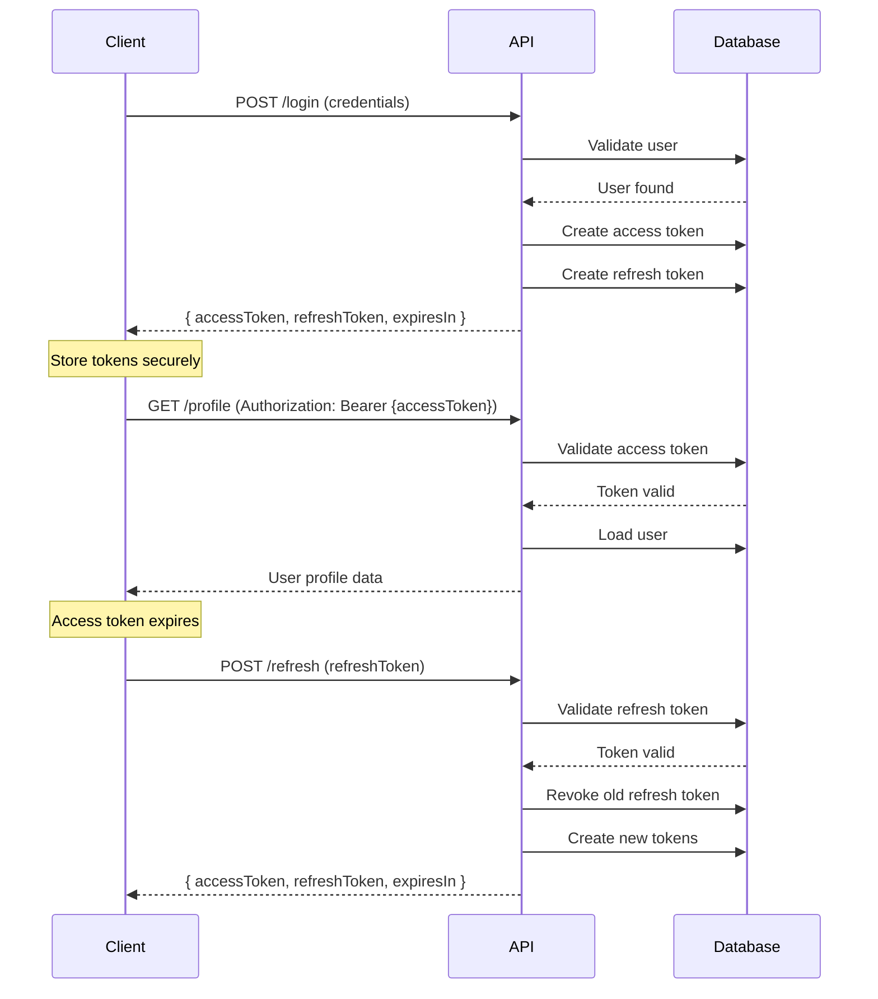

# Introduction

Warlock.js provides a robust, JWT-based authentication system designed for modern API applications. The authentication package (`@warlock.js/auth`) handles user authentication, token management, session tracking, and provides a foundation for building secure applications.

## Key Features

- **JWT-Based Authentication** - Industry-standard JSON Web Tokens for stateless authentication
- **Dual Token System** - Short-lived access tokens + long-lived refresh tokens
- **Token Rotation** - Automatic refresh token rotation for enhanced security
- **Multi-User Types** - Support for different user types (users, admins, etc.)
- **Session Management** - Track active sessions with device information
- **Event System** - Comprehensive lifecycle events for logging and monitoring
- **Database-Backed** - Tokens stored in database for revocation and tracking

## How It Works

Warlock.js uses a **dual-token authentication flow** combining access tokens and refresh tokens:



### Authentication Flow

1. **Login** - User provides credentials, receives access + refresh tokens
2. **Request** - Client sends access token in `Authorization` header
3. **Validation** - Middleware validates token and loads user into `request.user`
4. **Refresh** - When access token expires, use refresh token to get new tokens
5. **Logout** - Revoke tokens to invalidate session

## Access Tokens vs Refresh Tokens

| Feature        | Access Token                               | Refresh Token                    |
| -------------- | ------------------------------------------ | -------------------------------- |
| **Purpose**    | Authenticate API requests                  | Obtain new access tokens         |
| **Lifetime**   | Short (default: 1 hour or `NO_EXPIRATION`) | Long (default: 7 days)           |
| **Storage**    | Database (`accessTokens` table)            | Database (`refreshTokens` table) |
| **Usage**      | Sent with every request                    | Used only for token refresh      |
| **Rotation**   | No                                         | Yes (configurable)               |
| **Revocation** | Individual or all                          | Individual, all, or by family    |

## Quick Start

### 1. Configure Authentication

```typescript
// src/config/auth.ts
import { NO_EXPIRATION, type AuthConfigurations } from "@warlock.js/auth";
import { env } from "@warlock.js/core";
import { User } from "app/users/models/user";

const authConfigurations: AuthConfigurations = {
  userType: {
    user: User,
  },
  jwt: {
    secret: env("JWT_SECRET"),
    expiresIn: NO_EXPIRATION, // or { hours: 1 }
    refresh: {
      enabled: true,
      secret: env("JWT_REFRESH_SECRET"),
      expiresIn: "7d",
      rotation: true,
    },
  },
};

export default authConfigurations;
```

### 2. Create User Model

```typescript
// app/users/models/user.ts
import { Auth } from "@warlock.js/auth";
import { v } from "@warlock.js/seal";

const userSchema = v.object({
  name: v.string().required(),
  email: v.string().email().required(),
  password: v.string().required(),
});

export class User extends Auth {
  public static table = "users";
  public static schema = userSchema;

  public get userType(): string {
    return "user";
  }
}
```

### 3. Create Login Controller

```typescript
// app/users/controllers/login.controller.ts
import type { RequestHandler } from "@warlock.js/core";
import { authService } from "@warlock.js/auth";
import { User } from "../models/user";

export const loginController: RequestHandler = async (request, response) => {
  const credentials = request.only(["email", "password"]);

  const result = await authService.login(User, credentials, {
    ip: request.ip,
    userAgent: request.userAgent,
  });

  if (!result) {
    return response.unauthorized({
      error: "Invalid credentials",
    });
  }

  return response.success({
    user: result.user,
    ...result.tokens,
  });
};
```

### 4. Protect Routes

```typescript
// app/users/routes.ts
import { router } from "@warlock.js/core";
import { authMiddleware } from "@warlock.js/auth";
import { loginController } from "./controllers/login.controller";
import { profileController } from "./controllers/profile.controller";

// Public route
router.post("/login", loginController);

// Protected route
router.get("/profile", profileController).middleware(authMiddleware());
```

### 5. Access Current User

```typescript
// app/users/controllers/profile.controller.ts
import type { RequestHandler } from "@warlock.js/core";

export const profileController: RequestHandler = async (request, response) => {
  const user = request.user; // Authenticated user from middleware

  return response.success({
    user,
  });
};
```

## Security Features

### Token Rotation

Refresh tokens are automatically rotated on each use. When a refresh token is used to obtain new tokens, the old refresh token is revoked and a new one is issued. This prevents token reuse attacks.

### Family Revocation

All refresh tokens belong to a "family" (identified by `familyId`). If a revoked token is reused (indicating a breach), the entire token family is revoked, logging out all sessions.

### Session Limits

Configure maximum active sessions per user. When the limit is exceeded, the oldest sessions are automatically revoked.

### Token Cleanup

Expired tokens can be cleaned up automatically using the CLI command:

```bash
warlock auth:cleanup
```

## What's Next?

- [Configuration](./configuration) - Configure JWT settings, user types, and token behavior
- [JWT Tokens](./jwt) - Deep dive into token generation, validation, and rotation
- [Middleware](./middleware) - Protect routes and access authenticated users
- [Route Protection](./route-protection) - Patterns for securing your API
- [Events](./events) - Hook into authentication lifecycle events
- [Auth Model](./auth-model) - Extend the Auth base class for custom user models
