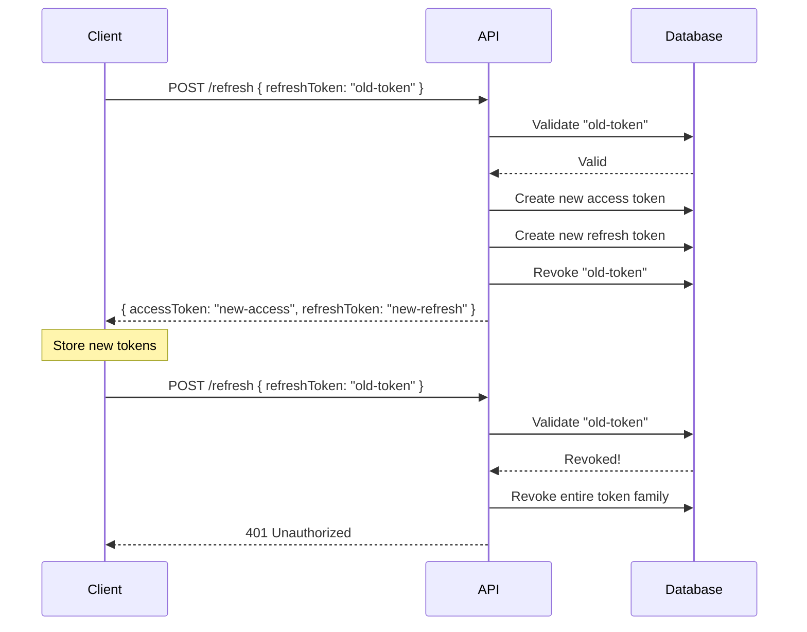

# JWT Tokens

Warlock.js uses a dual-token system with short-lived **access tokens** and long-lived **refresh tokens** to provide secure, stateless authentication.

## Token Types

### Access Tokens

Access tokens are used to authenticate API requests. They are:

- **Short-lived** - Default 1 hour (or `NO_EXPIRATION`)
- **Sent with every request** - In the `Authorization` header
- **Stored in database** - For validation and revocation
- **Contain user info** - User ID, user type, and custom payload

### Refresh Tokens

Refresh tokens are used to obtain new access tokens without re-authenticating. They are:

- **Long-lived** - Default 7 days
- **Used only for token refresh** - Not sent with regular requests
- **Rotated on use** - New refresh token issued, old one revoked
- **Tracked by family** - For breach detection
- **Include device info** - IP, user agent, device ID

## Token Generation

### Login Flow

The most common way to generate tokens is through the login flow:

```typescript
import type { RequestHandler } from "@warlock.js/core";
import { authService } from "@warlock.js/auth";
import { User } from "../models/user";

export const loginController: RequestHandler = async (request, response) => {
  const credentials = request.only(["email", "password"]);

  const result = await authService.login(User, credentials, {
    ip: request.ip,
    userAgent: request.userAgent,
    deviceId: request.input("deviceId"), // Optional
  });

  if (!result) {
    return response.unauthorized({
      error: "Invalid credentials",
    });
  }

  return response.success({
    user: result.user,
    accessToken: result.tokens.accessToken,
    refreshToken: result.tokens.refreshToken,
    expiresIn: result.tokens.expiresIn,
  });
};
```

The `authService.login()` method:

1. Validates credentials using `Model.attempt()`
2. Generates access token
3. Generates refresh token (if enabled)
4. Stores tokens in database
5. Emits `login.success` event
6. Returns user and token pair

### Manual Token Generation

You can also generate tokens manually:

```typescript
import { User } from "./models/user";

// Get user
const user = await User.find(1);

// Generate both tokens
const tokens = await user.createTokenPair({
  ip: "192.168.1.1",
  userAgent: "Mozilla/5.0...",
});

console.log(tokens);
// {
//   accessToken: "eyJhbGciOiJIUzI1NiIsInR5cCI6IkpXVCJ9...",
//   refreshToken: "eyJhbGciOiJIUzI1NiIsInR5cCI6IkpXVCJ9...",
//   expiresIn: "1h"
// }

// Generate only access token
const accessToken = await user.generateAccessToken();

// Generate only refresh token
const refreshToken = await user.generateRefreshToken({
  ip: "192.168.1.1",
  userAgent: "Mozilla/5.0...",
});
```

### Custom Payload

Add custom data to the access token payload:

```typescript
const accessToken = await user.generateAccessToken({
  role: "admin",
  permissions: ["read", "write"],
  customField: "value",
});
```

This data will be available in `request.decodedAccessToken` when the token is validated.

## Token Validation

Token validation happens automatically through the `authMiddleware`. When a request is made:

1. Middleware extracts token from `Authorization` header
2. Verifies JWT signature
3. Checks token exists in database
4. Loads user from database
5. Sets `request.user` and `request.decodedAccessToken`

```typescript
import { router } from "@warlock.js/core";
import { authMiddleware } from "@warlock.js/auth";

router
  .get("/profile", async (request, response) => {
    // Token already validated by middleware
    const user = request.user;
    const tokenData = request.decodedAccessToken;

    return response.success({ user, tokenData });
  })
  .middleware(authMiddleware());
```

### Manual Validation

You can also validate tokens manually:

```typescript
import { jwt } from "@warlock.js/auth";

try {
  const decoded = await jwt.verify(token);
  console.log(decoded); // { id: 1, userType: "user", ... }
} catch (error) {
  console.error("Invalid token");
}
```

## Token Refresh

When an access token expires, use the refresh token to obtain new tokens:

```typescript
import type { RequestHandler } from "@warlock.js/core";
import { authService } from "@warlock.js/auth";

export const refreshController: RequestHandler = async (request, response) => {
  const refreshToken = request.input("refreshToken");

  const tokens = await authService.refreshTokens(refreshToken, {
    ip: request.ip,
    userAgent: request.userAgent,
  });

  if (!tokens) {
    return response.unauthorized({
      error: "Invalid or expired refresh token",
    });
  }

  return response.success(tokens);
};
```

### Token Rotation

When refresh token rotation is enabled (default), the refresh flow:

1. Validates the provided refresh token
2. Generates new access token
3. Generates new refresh token
4. Revokes the old refresh token
5. Returns new token pair

This prevents refresh token reuse attacks.



### Family Revocation

All refresh tokens belong to a "family" identified by `familyId`. If a revoked token is reused (indicating a potential breach), the entire family is revoked:

```typescript
// This happens automatically in authService.refreshTokens()
if (refreshToken.isRevoked) {
  // Breach detected! Revoke all tokens in this family
  await authService.revokeTokenFamily(refreshToken.get("familyId"));
  throw new Error("Token reuse detected");
}
```

This logs out all sessions created from the original login, protecting the user's account.

## Session Management

### Active Sessions

Get all active sessions for a user:

```typescript
const user = await User.find(1);
const sessions = await user.activeSessions();

console.log(sessions);
// [
//   {
//     token: "eyJhbGciOiJIUzI1NiIsInR5cCI6IkpXVCJ9...",
//     deviceInfo: { ip: "192.168.1.1", userAgent: "..." },
//     lastUsedAt: Date,
//     expiresAt: Date,
//   },
//   ...
// ]
```

### Session Limits

Configure maximum active sessions per user in `src/config/auth.ts`:

```typescript
jwt: {
  refresh: {
    maxPerUser: 5, // Default: 5
  },
}
```

When the limit is exceeded, the oldest refresh tokens are automatically revoked.

### Device Tracking

Track device information with each session:

```typescript
const tokens = await user.createTokenPair({
  ip: request.ip,
  userAgent: request.userAgent,
  deviceId: "unique-device-id", // Optional
});
```

This information is stored with the refresh token and can be used to display active sessions to users.

## Token Revocation

### Revoke Access Token

Remove a specific access token:

```typescript
const user = request.user;
const token = request.authorizationValue;

await user.removeAccessToken(token);
```

### Revoke All Tokens

Log out from all devices:

```typescript
const user = request.user;
await user.revokeAllTokens();
```

This revokes:

- All access tokens
- All refresh tokens

### Revoke Token Family

Revoke all tokens in a specific family (used for breach detection):

```typescript
import { authService } from "@warlock.js/auth";

await authService.revokeTokenFamily("family-id");
```

### Logout

The recommended way to revoke tokens is through the logout service:

```typescript
import type { RequestHandler } from "@warlock.js/core";
import { authService } from "@warlock.js/auth";

export const logoutController: RequestHandler = async (request, response) => {
  const user = request.user;
  const accessToken = request.authorizationValue;
  const refreshToken = request.input("refreshToken");

  await authService.logout(user, accessToken, refreshToken);

  return response.success({
    message: "Logged out successfully",
  });
};
```

**Logout behavior:**

- If `refreshToken` is provided: Revokes that specific refresh token and the access token
- If `refreshToken` is not provided:
  - `logoutWithoutToken: "revoke-all"` (default) - Revokes all tokens
  - `logoutWithoutToken: "error"` - Throws an error

## Token Cleanup

Expired tokens remain in the database until cleaned up. Run cleanup periodically:

```bash
warlock auth:cleanup
```

Or programmatically:

```typescript
import { authService } from "@warlock.js/auth";

const expiredCount = await authService.cleanupExpiredTokens();
console.log(`Cleaned up ${expiredCount} expired tokens`);
```

> [!TIP]
> Set up a cron job or scheduled task to run cleanup daily:
>
> ```typescript
> // src/app/main.ts or a scheduler
> import { authService } from "@warlock.js/auth";
>
> setInterval(
>   async () => {
>     await authService.cleanupExpiredTokens();
>   },
>   24 * 60 * 60 * 1000,
> ); // Daily
> ```

## Token Payload Structure

### Access Token Payload

```typescript
{
  id: 1,                    // User ID
  userType: "user",         // User type
  iat: 1234567890,          // Issued at (timestamp)
  exp: 1234571490,          // Expires at (timestamp, if not NO_EXPIRATION)
  // ... any custom payload data
}
```

### Refresh Token Payload

```typescript
{
  userId: 1,                // User ID
  userType: "user",         // User type
  familyId: "abc123",       // Token family ID
  iat: 1234567890,          // Issued at
  exp: 1235172690,          // Expires at
}
```

## Security Best Practices

> [!IMPORTANT]
> **Access Token Expiration**
>
> Use short-lived access tokens (1 hour or less) with refresh tokens. This limits the damage if an access token is compromised.

> [!WARNING]
> **NO_EXPIRATION Usage**
>
> Only use `NO_EXPIRATION` for access tokens in development or specific use cases (e.g., API keys). For user authentication, always use expiring tokens.

> [!CAUTION]
> **Token Storage**
>
> - **Access tokens**: Can be stored in memory or secure storage
> - **Refresh tokens**: Must be stored securely (httpOnly cookies, secure storage)
> - Never store tokens in localStorage in web applications (XSS vulnerability)

> [!TIP]
> **Enable Token Rotation**
>
> Keep refresh token rotation enabled in production. It significantly improves security by preventing token reuse attacks.

## What's Next?

- [Middleware](./middleware) - Protect routes with authentication
- [Route Protection](./route-protection) - Advanced route protection patterns
- [Events](./events) - Hook into token lifecycle events
- [Configuration](./configuration) - Configure token behavior
