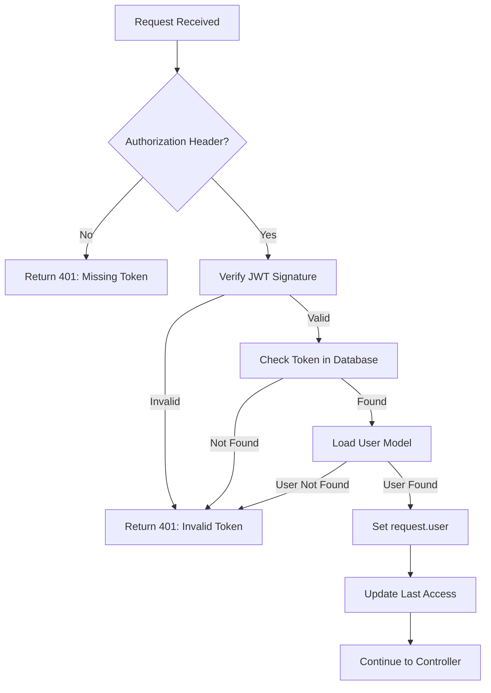

# Middleware

The `authMiddleware` validates JWT tokens and loads the authenticated user into the request object, making it available to your controllers.

## Basic Usage

Import and apply the middleware to protected routes:

```typescript
import { router } from "@warlock.js/core";
import { authMiddleware } from "@warlock.js/auth";
import { profileController } from "./controllers/profile.controller";

router.get("/profile", profileController).middleware(authMiddleware());
```

## How It Works

When a request hits a route protected by `authMiddleware`:

1. **Extract Token** - Gets JWT from `Authorization: Bearer <token>` header
2. **Verify JWT** - Validates the token signature and expiration
3. **Check Database** - Verifies token exists in `accessTokens` table
4. **Load User** - Fetches user from database using the user type and ID
5. **Set Request Properties** - Populates `request.user` and `request.decodedAccessToken`
6. **Update Last Access** - Updates token's `lastAccess` timestamp

If any step fails, the middleware returns a `401 Unauthorized` response.



## Accessing the User

Once authenticated, access the user in your controller:

```typescript
import type { RequestHandler } from "@warlock.js/core";

export const profileController: RequestHandler = async (request, response) => {
  // Get authenticated user
  const user = request.user;

  // Get decoded token data
  const tokenData = request.decodedAccessToken;

  return response.success({
    user,
    tokenData,
  });
};
```

### Available Properties

**`request.user`** - The authenticated user model instance

```typescript
const user = request.user;
console.log(user.get("id"));
console.log(user.get("email"));
console.log(user.get("name"));
```

**`request.decodedAccessToken`** - The decoded JWT payload

```typescript
const tokenData = request.decodedAccessToken;
console.log(tokenData);
// {
//   id: 1,
//   userType: "user",
//   iat: 1234567890,
//   exp: 1234571490,
//   // ... any custom payload
// }
```

**`request.authorizationValue`** - The raw token string

```typescript
const token = request.authorizationValue;
// "eyJhbGciOiJIUzI1NiIsInR5cCI6IkpXVCJ9..."
```

## Optional Authentication

To make authentication optional (allow both authenticated and guest requests), call the middleware without checking for a token:

```typescript
router.get("/posts", postsController).middleware(authMiddleware());
```

When no `Authorization` header is provided:

- `request.user` will be `undefined`
- The request continues normally

Check for authentication in your controller:

```typescript
export const postsController: RequestHandler = async (request, response) => {
  const user = request.user;

  if (user) {
    // User is authenticated - show personalized content
    const posts = await Post.find({ userId: user.get("id") });
    return response.success({ posts });
  } else {
    // User is not authenticated - show public content
    const posts = await Post.find({ isPublic: true });
    return response.success({ posts });
  }
};
```

> [!NOTE]
> Optional authentication only works when you don't specify a user type. If you specify a user type, the token becomes required.

## User Type Restrictions

Restrict routes to specific user types:

### Single User Type

```typescript
import { authMiddleware } from "@warlock.js/auth";

// Only allow "admin" users
router
  .get("/admin/dashboard", dashboardController)
  .middleware(authMiddleware("admin"));
```

### Multiple User Types

```typescript
// Allow "admin" or "moderator" users
router
  .get("/moderation/reports", reportsController)
  .middleware(authMiddleware(["admin", "moderator"]));
```

### How User Types Work

1. The middleware extracts `userType` from the JWT payload
2. Checks if it matches the allowed types
3. Loads the corresponding model from `auth.userType` config
4. Returns `401 Unauthorized` if type doesn't match

**Configuration:**

```typescript
// src/config/auth.ts
import { User } from "app/users/models/user";
import { Admin } from "app/admins/models/admin";

const authConfigurations: AuthConfigurations = {
  userType: {
    user: User,
    admin: Admin,
  },
  // ...
};
```

**User Models:**

```typescript
export class User extends Auth {
  public get userType(): string {
    return "user";
  }
}

export class Admin extends Auth {
  public get userType(): string {
    return "admin";
  }
}
```

## Route Groups

Apply authentication to multiple routes using groups:

```typescript
import { router } from "@warlock.js/core";
import { authMiddleware } from "@warlock.js/auth";

// All routes in this group require authentication
router.group(
  {
    middleware: [authMiddleware()],
  },
  () => {
    router.get("/profile", profileController);
    router.put("/profile", updateProfileController);
    router.get("/settings", settingsController);
  },
);
```

### Nested Groups

Combine different user type restrictions:

```typescript
// Public routes
router.post("/login", loginController);
router.post("/register", registerController);

// User routes (any authenticated user)
router.group(
  {
    prefix: "/user",
    middleware: [authMiddleware()],
  },
  () => {
    router.get("/profile", profileController);
    router.get("/orders", ordersController);
  },
);

// Admin routes (admin users only)
router.group(
  {
    prefix: "/admin",
    middleware: [authMiddleware("admin")],
  },
  () => {
    router.get("/dashboard", dashboardController);
    router.get("/users", usersController);
  },
);
```

## Combining Middleware

Combine `authMiddleware` with other middleware:

```typescript
import { authMiddleware } from "@warlock.js/auth";
import { rateLimitMiddleware } from "./middleware/rate-limit";
import { loggingMiddleware } from "./middleware/logging";

router
  .get("/api/data", dataController)
  .middleware([loggingMiddleware, rateLimitMiddleware, authMiddleware()]);
```

Middleware executes in the order specified.

## Error Handling

The middleware returns specific error codes for different failure scenarios:

### Missing Access Token (EC001)

No `Authorization` header provided (when user type is specified):

```json
{
  "error": "Missing access token",
  "errorCode": "EC001"
}
```

### Invalid Access Token (EC002)

Token is invalid, expired, or not found in database:

```json
{
  "error": "Invalid access token",
  "errorCode": "EC002"
}
```

### Unauthorized User Type (EC003)

User type doesn't match allowed types:

```json
{
  "error": "Unauthorized",
  "errorCode": "EC003"
}
```

### Custom Error Handling

Handle auth errors in your error handler:

```typescript
import { AuthErrorCodes } from "@warlock.js/auth";

export const errorHandler = (error, request, response) => {
  if (error.errorCode === AuthErrorCodes.InvalidAccessToken) {
    // Custom handling for invalid tokens
    return response.unauthorized({
      error: "Your session has expired. Please login again.",
    });
  }

  // Handle other errors
};
```

## Translation Keys

The middleware uses these translation keys for error messages:

- `auth.errors.missingAccessToken` - When token is missing
- `auth.errors.invalidAccessToken` - When token is invalid
- `auth.errors.unauthorized` - When user type is not allowed

Customize these in your translation files:

```typescript
// src/app/locales/en.ts
import { groupedTranslations } from "@warlock.js/core";

groupedTranslations({
  auth: {
    errors: {
      missingAccessToken: {
        en: "Authentication required",
        ar: "المصادقة مطلوبة",
      },
      invalidAccessToken: {
        en: "Invalid or expired token",
        ar: "رمز غير صالح أو منتهي الصلاحية",
      },
      unauthorized: {
        en: "You don't have permission to access this resource",
        ar: "ليس لديك إذن للوصول إلى هذا المورد",
      },
    },
  },
});
```

## Advanced Patterns

### Conditional Middleware

Apply middleware based on conditions:

```typescript
const conditionalAuth = (request, response, next) => {
  const isPublicRoute = request.path.startsWith("/public");

  if (isPublicRoute) {
    return next();
  }

  return authMiddleware()(request, response, next);
};

router.get("/data", dataController).middleware(conditionalAuth);
```

### Custom User Loading

Extend the middleware for custom user loading logic:

```typescript
import { authMiddleware } from "@warlock.js/auth";
import type { Middleware } from "@warlock.js/core";

export const customAuthMiddleware = (): Middleware => {
  const baseAuth = authMiddleware();

  return async (request, response) => {
    // Run base authentication
    const result = await baseAuth(request, response);

    if (result) return result; // Auth failed

    // Custom logic after successful auth
    const user = request.user;

    // Load additional user data
    user.set("permissions", await loadUserPermissions(user.get("id")));

    // Continue
  };
};
```

## Best Practices

> [!TIP]
> **Use Groups for Organization**
>
> Group related routes together and apply middleware at the group level. This keeps your routes clean and maintainable.

> [!IMPORTANT]
> **User Type Configuration**
>
> Always configure all user types in `src/config/auth.ts`. Missing user types will cause runtime errors.

> [!WARNING]
> **Optional Auth Caveats**
>
> When using optional authentication, always check `if (request.user)` before accessing user properties to avoid runtime errors.

## What's Next?

- [Route Protection](./route-protection) - Advanced route protection patterns
- [Access Control](./access-control) - Implement RBAC and permissions
- [JWT Tokens](./jwt) - Understand token generation and validation
- [Configuration](./configuration) - Configure user types and JWT settings
