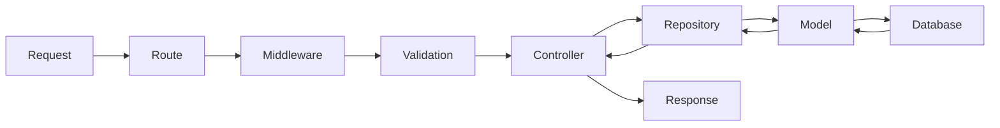

# Core Concepts

Before diving into code, let's understand how Warlock.js thinks. These concepts will help you structure your applications effectively.

## Modules

Warlock.js organizes code by **features**, not by layers. Each module is a self-contained directory that represents one feature of your application.

```
src/app/
├── users/          # Everything about users
├── posts/          # Everything about posts
├── orders/         # Everything about orders
└── utils/          # Shared utilities
```

### Why Modules?

- **Cohesion** — Related code stays together
- **Scalability** — Add features without touching existing ones
- **Clarity** — New developers know exactly where to look
- **Portability** — Move or remove features easily

### Typical Module Structure

```
users/
├── controllers/       # Request handlers
├── models/            # Database entities
├── repositories/      # Data access layer
├── output/            # Response transformers
├── events/            # Event handlers
├── utils/             # Module-specific utilities
│   ├── flags.ts       # Constants and enums
│   └── locales.ts     # Translations
├── routes.ts          # Route definitions
└── main.ts            # Module entry point (optional)
```

You don't need all these directories for every module. Start simple and add as needed.

## Configurations

Warlock.js uses a **three-layer configuration pattern**:

```
.env (secrets) → config files (logic) → app code (usage)
```

### 1. Environment Variables (`.env`)

Store secrets and environment-specific values:

```env
DB_HOST=localhost
DB_PORT=27017
JWT_SECRET=your-secret-key
```

### 2. Config Files (`src/config/`)

Transform env variables into structured configuration:

```typescript title="src/config/database.ts"
import { env } from "@warlock.js/core";

export default {
  driver: env("DB_DRIVER", "mongodb"),
  host: env("DB_HOST"),
  port: env("DB_PORT"),
  name: env("DB_NAME"),
};
```

### 3. App Code

Use the config in your application:

```typescript
import { config } from "@warlock.js/core";

const dbName = config("database.name");
```

All config files in `src/config/` are **auto-loaded** on startup.

## Connectors

Connectors manage external service connections. Warlock.js includes connectors for:

- **Database** — MongoDB or PostgreSQL
- **Cache** — Redis, Memory, File, etc.
- **HTTP** — Fastify server
- **Storage** — S3, Local file storage
- **Communicator** — RabbitMQ, Kafka (via Herald)

### Lifecycle

Connectors have a lifecycle:

1. **Initialize** — Connect to the service
2. **Restart** — Reconnect if needed
3. **Shutdown** — Clean up on app exit

You rarely interact with connectors directly—Warlock.js handles them for you.

## Hot Module Reload (HMR)

Warlock's dev server watches your files and reloads changes **instantly**—no server restart needed.

### How It Works

1. You save a file
2. Dev server detects the change
3. Only the affected modules are reloaded
4. Server stays running

### What Gets Reloaded?

- **Routes** — Add, remove, or change routes
- **Controllers** — Update request handlers
- **Events** — Modify event listeners
- **Configs** — Change configuration files

:::tip
HMR is **much faster** than `nodemon` because it doesn't restart the entire server. It only reloads what changed.
:::

Learn more in the [Dev Server](./dev-server-overview) section.

## Request Lifecycle

Understanding how a request flows through Warlock.js helps you know where to put your code.



### Step-by-Step

1. **Request** — Client sends HTTP request
2. **Route** — Warlock.js matches the URL to a route
3. **Middleware** — Auth, logging, etc. run first
4. **Validation** — Request data is validated
5. **Controller** — Your handler processes the request
6. **Repository** — Data access layer queries the database
7. **Model** — ORM interacts with the database
8. **Response** — Controller returns formatted response

## Models

Models represent **database entities** using the Cascade ORM.

```typescript title="src/app/posts/models/post.ts"
import { Model } from "@warlock.js/cascade";

export class Post extends Model {
  public static collection = "posts";

  protected schema = {
    title: String,
    content: String,
    authorId: Number,
    createdAt: Date,
  };
}
```

Models handle:

- **Schema definition** — What fields exist
- **Relations** — How entities connect
- **Queries** — Finding and updating data
- **Validation** — Database-level constraints

Learn more in the [Database](../database/introduction) section.

## Repositories

Repositories are the **data access layer**. They sit between controllers and models, providing a clean API for data operations.

```typescript title="src/app/posts/repositories/posts-repository.ts"
import { RepositoryManager } from "@warlock.js/core";
import { Post } from "../models/post";

export class PostsRepository extends RepositoryManager {
  public model = Post;

  protected filterBy = {
    authorId: "int",
    published: "boolean",
  };
}

export const postsRepository = new PostsRepository();
```

### Why Use Repositories?

- **Abstraction** — Controllers don't need to know about database queries
- **Filtering** — Built-in support for query parameters
- **Pagination** — Automatic pagination support
- **Caching** — Optional caching layer
- **Consistency** — Standardized data access patterns

Learn more in the [Repositories](../repositories/introduction) section.

## Events

Events let you **decouple side effects** from your main business logic.

### Publishing Events

```typescript title="src/app/posts/controllers/create-post.controller.ts"
import { events } from "@warlock.js/core";

export const createPostController: RequestHandler = async (
  request,
  response,
) => {
  const post = await Post.create(request.validated());

  // Publish event
  events.trigger("posts.created", post);

  return response.success({ post });
};
```

### Listening to Events

```typescript title="src/app/posts/events/post-created.ts"
import { events } from "@warlock.js/core";
import { sendEmail } from "@warlock.js/postman";

events.on("posts.created", async (post) => {
  // Send notification email
  await sendEmail({
    to: post.author.email,
    subject: "Your post was published!",
    template: "post-published",
    data: { post },
  });
});
```

### Why Events?

- **Decoupling** — Controllers stay focused on the request
- **Reusability** — Multiple listeners can react to one event
- **Testability** — Easy to test event handlers in isolation
- **Scalability** — Move to message queues later without changing code

## Putting It All Together

Here's how these concepts work together in a real feature:

```
posts/
├── routes.ts              # Define /posts endpoints
├── controllers/
│   └── create-post.ts     # Handle POST /posts
├── models/
│   └── post.ts            # Post database schema
├── repositories/
│   └── posts-repo.ts      # Data access for posts
└── events/
    └── post-created.ts    # Send email when post is created
```

**Flow:**

1. User hits `POST /posts`
2. Route matches and runs validation
3. Controller creates post via repository
4. Repository uses model to save to database
5. Controller publishes `posts.created` event
6. Event handler sends notification email
7. Controller returns success response

## Next Steps

Now that you understand the concepts, let's explore the structure:

- **[Project Structure](./project-structure)** — See where everything lives
- **[Environment & Config](./env-config)** — Configure your app
- **[HTTP Basics](../http/routing-basics)** — Start building routes

:::tip Quick Reference
Bookmark this page! These concepts apply throughout Warlock. Understanding them will make the rest of the docs much easier to follow.
:::
