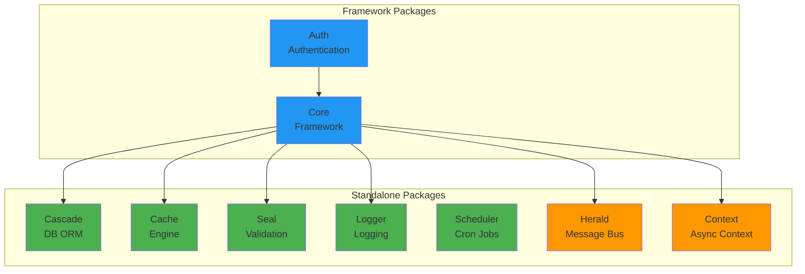

# Warlock.js v4 Source Code Review

## Overview

Warlock.js v4 is a comprehensive Node.js framework consisting of **9 monorepo packages** organized into standalone libraries and framework-coupled components.

### Package Structure



> [!IMPORTANT] > **New Packages in v4**: `herald` (message bus) and `context` (async context management) are new additions not present in v3.

---

## Standalone Packages

### 1. @warlock.js/cascade (DB ORM)

**Purpose**: Full-featured ORM with multi-database support

#### Key Features

- **Multi-Database Support**
  - MongoDB (native driver)
  - PostgreSQL (SQL support)
  - Shared SQL infrastructure
- **Core Capabilities**
  - Model system with dirty tracking
  - Relations (pivot operations, relation loader)
  - Query builders per driver
  - Migration system with driver-specific implementations
  - Sync system for data synchronization
  - Database writer, remover, restorer
  - Expressions system
  - Validation integration
  - Data sources and context management
  - Transaction support

#### Architecture

```
cascade/
├── context/          # Database contexts (data source, transactions)
├── contracts/        # Driver contracts, query builder interfaces
├── data-source/      # Data source and registry
├── drivers/
│   ├── mongodb/      # MongoDB driver + query builder
│   ├── postgres/     # PostgreSQL driver + query builder
│   └── sql/          # Shared SQL infrastructure
├── events/           # Model lifecycle events
├── expressions/      # Query expressions
├── migration/        # Migration system
├── model/            # Core Model class
├── relations/        # Relations system (pivot, loader)
├── remover/          # Delete operations
├── restorer/         # Restore soft-deleted records
├── sync/             # Data sync system
├── validation/       # Model validation
├── writer/           # Save/update operations
└── utils/            # Helper utilities
```

#### Notable Exports

- `Model` - Base model class
- `defineModel()` - Model definition helper
- Query builders: `MongodbQueryBuilder`, `PostgresQueryBuilder`
- Drivers: `MongoDbDriver`, `PostgresDriver`
- Migration: `Migration`, `MongoMigrationDriver`
- Relations: Relation loader, pivot operations
- Sync: `modelSync()`, `SyncManager`

---

### 2. @warlock.js/cache (Cache Engine)

**Purpose**: Flexible caching with driver support and tag-based invalidation

#### Key Features

- **Tagged Cache System** - Invalidate related cache entries by tags
- **Driver Architecture** - Pluggable cache drivers
- **Cache Manager** - Centralized cache management

#### Structure

```
cache/
├── drivers/          # Cache driver implementations
├── cache-manager.ts
├── tagged-cache.ts
├── types.ts
└── utils.ts
```

---

### 3. @warlock.js/seal (Validation Library)

**Purpose**: Framework-agnostic, type-safe validation with extensive validators

#### Key Features

- **18 Validators**: Any, Array, Boolean, Computed, Date, Float, Int, Managed, Number, Numeric, Object, Record, Scalar, String, Tuple, Union
- **Factory Pattern**: `v` object for fluent validation
- **Plugin System**: Extensible validation rules
- **Mutators**: Data transformations
- **Framework-Agnostic**: Core validators work standalone

#### Structure

```
seal/
├── validators/       # 18 validator classes
├── rules/            # Core validation rules
├── types/            # Type definitions
├── helpers/          # Utility functions
├── mutators/         # Data transformations
├── plugins/          # Plugin system
├── factory/          # v object and validate()
└── config.ts
```

> [!NOTE]
> Framework-specific features (FileValidator, database rules) are in `@warlock.js/core/validation`

---

### 4. @warlock.js/logger (Logging)

**Purpose**: Multi-channel logging system

#### Key Features

- **Channel-Based Logging** - Route logs to different channels
- **Log Levels** - Standard logging levels (debug, info, warn, error)
- **Utilities** - Formatting and helper functions

#### Structure

```
 logger/
├── channels/         # Channel implementations
├── log-channel.ts
├── logger.ts
├── types.ts
└── utils/
```

---

### 5. @warlock.js/scheduler (Cron Jobs)

**Purpose**: Production-ready job scheduler with cron-like functionality

#### Key Features

- **Fluent API**: `.daily()`, `.hourly()`, `.at()`, `.inTimezone()`
- **Cron Expressions**: Full cron syntax support
- **Job Management**: Retry logic, overlap prevention
- **Observability**: Event system for monitoring

#### Structure

```
scheduler/
├── cron-parser.ts    # Cron expression parser
├── job.ts            # Job class with fluent API
├── scheduler.ts      # Main scheduler
├── types.ts
└── utils.ts
```

#### Example API

```typescript
scheduler.addJob(
  job("cleanup", cleanupFn).daily().at("03:00").preventOverlap().retry(3, 1000)
);
```

---

### 6. @warlock.js/herald (Message Bus) 🆕

**Purpose**: Type-safe message bus for RabbitMQ, Kafka, and more

> [!IMPORTANT] > **NEW IN V4** - This package did not exist in v3

#### Key Features

- **Multi-Driver Support**: RabbitMQ (currently), Kafka (extensible)
- **Type-Safe Messaging**: TypeScript generics for payload types
- **Pub/Sub Pattern**: Channel-based publishing and subscriptions
- **Message Management**: Ack/nack handling
- **Decorators**: `@Consumable` for consumer registration

#### Structure

```
herald/
├── contracts/        # Driver contracts
├── communicators/    # Communicator and registry
├── drivers/
│   └── rabbitmq/     # RabbitMQ implementation
├── message-managers/ # Message handling
├── decorators/       # Consumer decorators
├── types.ts
└── utils/            # Connection helpers
```

#### Example API

```typescript
// Connect
await connectToCommunicator({
  driver: "rabbitmq",
  host: "localhost",
  port: 5672,
});

// Publish
await communicators().channel("user.created").publish({ userId: 1 });

// Subscribe
communicators()
  .channel<UserPayload>("user.created")
  .subscribe(async (message, ctx) => {
    console.log(message.payload);
    await ctx.ack();
  });
```

---

### 7. @warlock.js/context (Async Context) 🆕

**Purpose**: Async context management (e.g., request context, transaction context)

> [!IMPORTANT] > **NEW IN V4** - This package did not exist in v3

#### Key Features

- **BaseContext**: Abstract base for context types
- **ContextManager**: Registry and lifecycle management
- **Async-Safe**: Works across async boundaries

#### Structure

```
context/
├── base-context.ts      # Abstract context base
└── context-manager.ts   # Context registry
```

---

## Framework Packages

### 8. @warlock.js/core (Framework)

**Purpose**: The main framework that ties everything together

#### Core Modules (23)

```
core/
├── application.ts       # Application bootstrap
├── bootstrap/           # Initialization logic
├── cache/               # Cache integration
├── cli/                 # CLI commands
├── config/              # Configuration management
├── database/            # Database integration
├── dev2-server/         # Dev server (health checks, connectors)
├── http/                # HTTP layer (Request, Response, UploadedFile)
│   ├── context/         # HTTP context
│   ├── database/        # HTTP database helpers
│   ├── errors/          # HTTP errors
│   ├── middleware/      # HTTP middleware
│   └── plugins/         # HTTP plugins
├── image/               # Image processing
├── logger/              # Logger integration
├── mail/                # Email system
├── react/               # React integration
├── repositories/        # Repository pattern
│   ├── adapters/
│   ├── contracts/
│   └── repository.manager.ts (35KB - complex logic)
├── resource/            # Resource layer
├── restful/             # RESTful controller base
├── router/              # Routing system
│   ├── route-builder.ts # Fluent route builder
│   ├── router.ts        # Main router (22KB)
│   └── types.ts
├── storage/             # File storage
├── store/               # State management
├── utils/               # Utilities
├── validation/          # Validation integration (Seal)
└── warlock-config/      # Framework configuration
```

#### Notable Features

**Router System**

- [route-builder.ts](file:///d:/xampp/htdocs/mongez/node/warlock.js/docs/warlock-docs-latest/@warlock.js/core/src/router/route-builder.ts) - Fluent API for route building
- [router.ts](file:///d:/xampp/htdocs/mongez/node/warlock.js/docs/warlock-docs-latest/@warlock.js/core/src/router/router.ts) - Main router (22KB)
- RESTful semantic aliases
- Nested routes
- Version helpers

**HTTP Layer**

- [request.ts](file:///d:/xampp/htdocs/mongez/node/warlock.js/docs/warlock-docs-latest/@warlock.js/core/src/http/request.ts) (21KB) - Request handling
- [response.ts](file:///d:/xampp/htdocs/mongez/node/warlock.js/docs/warlock-docs-latest/@warlock.js/core/src/http/response.ts) (29KB) - Response handling
- [uploaded-file.ts](file:///d:/xampp/htdocs/mongez/node/warlock.js/docs/warlock-docs-latest/@warlock.js/core/src/http/uploaded-file.ts) (23KB) - File upload handling
- Middleware system
- Plugin architecture

**Repositories**

- [repository.manager.ts](file:///d:/xampp/htdocs/mongez/node/warlock.js/docs/warlock-docs-latest/@warlock.js/core/src/repositories/repository.manager.ts) (35KB) - Complex repository logic
- Filter system (scope, where, etc.)
- Adapter pattern
- Contract-based design

**RESTful**

- [restful.ts](file:///d:/xampp/htdocs/mongez/node/warlock.js/docs/warlock-docs-latest/@warlock.js/core/src/restful/restful.ts) (10KB) - RESTful controller base

**CLI**

- Command system
- Generators

**Dev Server**

- Health checks
- Connectors

---

### 9. @warlock.js/auth (Authentication)

**Purpose**: Authentication system fully coupled with the framework

#### Key Components

```
auth/
├── commands/         # Auth CLI commands
│   ├── auth-cleanup-command
│   └── jwt-secret-generator-command
├── contracts/        # Auth contracts
├── middleware/       # Auth middleware
├── models/           # Auth models
├── services/         # Auth services
└── utils/            # Auth utilities
```

#### Notable Features

- JWT secret generation
- Auth cleanup commands
- Auth middleware
- User models
- Authentication services

---

## Key Architectural Patterns

### 1. **Monorepo Structure**

All packages are organized in `@warlock.js/*` with clear separation of concerns.

### 2. **Driver Pattern**

Used extensively in:

- Cascade (MongoDB, PostgreSQL drivers)
- Cache (cache drivers)
- Herald (RabbitMQ, extensible to Kafka)
- Logger (channel drivers)

### 3. **Contract-Based Design**

Every package uses TypeScript interfaces/contracts for extensibility:

- `DatabaseDriverContract`
- `QueryBuilderContract`
- `RepositoryContract`
- `CommunicatorDriverContract`

### 4. **Fluent APIs**

Builder patterns for developer experience:

- Router: `.get()`, `.post()`, `.group()`
- Scheduler: `.daily()`, `.at()`, `.retry()`
- Validation: `v.string().required().minLength(3)`

### 5. **Event-Driven**

- Model events in Cascade
- Scheduler job events
- Application lifecycle events

### 6. **Context Management**

- HTTP context in Core
- Database context in Cascade
- Async context in Context package
- Transaction context

---

## Major v4 Additions (vs v3)

> [!WARNING]
> This section requires comparison with v3 docs to be fully accurate

### Confirmed New Additions

1. **@warlock.js/herald** - Complete message bus system
2. **@warlock.js/context** - Async context management
3. **PostgreSQL Support** - Full SQL driver in Cascade
4. **Sync System** - Data synchronization in Cascade
5. **Tagged Cache** - Cache invalidation by tags
6. **Fluent Scheduler API** - Enhanced job scheduling

### Potential New/Enhanced Features

Based on code structure, these appear to be new or significantly enhanced:

- **Relations System** - Pivot operations, relation loader
- **Migration System** - Driver-specific migrations
- **Repository Pattern** - Complex filter system with scopes
- **RESTful Base Controllers** - Enhanced REST support
- **Plugin System** - In HTTP, Seal validation
- **Dev Server Tools** - Health checks, connectors
- **React Integration** - React support module
- **Image Processing** - Image handling module
- **Storage System** - File storage abstraction

---

## Database Drivers Comparison

### MongoDB Driver

- Native MongoDB client integration
- MongoDB-specific query builder
- MongoDB ID generator
- MongoDB sync adapter
- MongoDB migration driver

### PostgreSQL Driver (NEW)

- PostgreSQL query builder
- SQL-specific features
- Shared SQL infrastructure
- PostgreSQL migration support

### Shared SQL Infrastructure

Common foundation for SQL databases, enabling future drivers (MySQL, SQLite, etc.)

---

## Validation System Architecture

### Standalone (`@warlock.js/seal`)

- 18 core validators
- Framework-agnostic
- Plugin system
- Mutators
- Factory pattern

### Framework Integration (`@warlock.js/core/validation`)

- FileValidator (file uploads)
- Database rules (unique, exists)
- Request validation
- Integration with HTTP layer

---

## Next Steps for Documentation

### Documentation Structure Recommendations

```
docs/
├── getting-started/
├── standalone-packages/
│   ├── cascade/          # DB ORM
│   ├── cache/            # Caching
│   ├── seal/             # Validation
│   ├── logger/           # Logging
│   ├── scheduler/        # Jobs
│   ├── herald/           # 🆕 Message Bus
│   └── context/          # 🆕 Async Context
├── framework/
│   ├── core/
│   │   ├── http/
│   │   ├── router/
│   │   ├── repositories/
│   │   ├── restful/
│   │   ├── cli/
│   │   └── ...
│   └── auth/
├── migrations/
│   └── v3-to-v4/        # Migration guide
└── api-reference/
```

### Priority Documentation Areas

1. **Herald** - Completely new, needs full documentation
2. **Context** - Completely new, needs full documentation
3. **PostgreSQL** - New driver, migration from MongoDB
4. **Relations** - Document pivot operations
5. **Sync System** - New feature in Cascade
6. **Router Enhancements** - Version helpers, nested routes
7. **Repository Filters** - Scope filter, advanced filters
8. **Tagged Cache** - New cache invalidation pattern

### Migration Guide (v3 → v4)

Required topics:

- Breaking changes
- New packages (Herald, Context)
- Enhanced validation system
- PostgreSQL support
- Router API changes
- Repository pattern updates

---

## Code Quality Observations

### Strengths

- **Type Safety**: Comprehensive TypeScript throughout
- **Modularity**: Clear package boundaries
- **Contracts**: Consistent interface-driven design
- **Documentation**: Good JSDoc comments in code
- **Examples**: Code includes usage examples

### Large Files (Potential Refactoring Candidates)

- `base-validator.ts` (44KB) - Complex validation logic
- `repository.manager.ts` (35KB) - Repository logic
- `response.ts` (29KB) - Response handling
- `date-validator.ts` (24KB) - Date validation
- `uploaded-file.ts` (23KB) - File upload handling
- `router.ts` (22KB) - Router logic
- `request.ts` (21KB) - Request handling
- `job.ts` (21KB) - Job scheduling

These files are feature-rich but may benefit from splitting into smaller modules for documentation clarity.

---

## Summary

Warlock.js v4 is a **comprehensive, production-ready framework** with:

- ✅ **9 packages** (7 standalone + 2 new)
- ✅ **Multi-database ORM** (MongoDB, PostgreSQL)
- ✅ **Type-safe validation** (Seal)
- ✅ **Message bus** (Herald - NEW)
- ✅ **Async context** (Context - NEW)
- ✅ **Job scheduling** (Scheduler)
- ✅ **Caching** with tags
- ✅ **Logging** with channels
- ✅ **Full HTTP stack** (Router, Request, Response)
- ✅ **Repository pattern**
- ✅ **RESTful controllers**
- ✅ **Authentication**
- ✅ **CLI tools**

The framework is **well-architected** with clear separation of concerns, driver patterns for extensibility, and fluent APIs for excellent developer experience.
